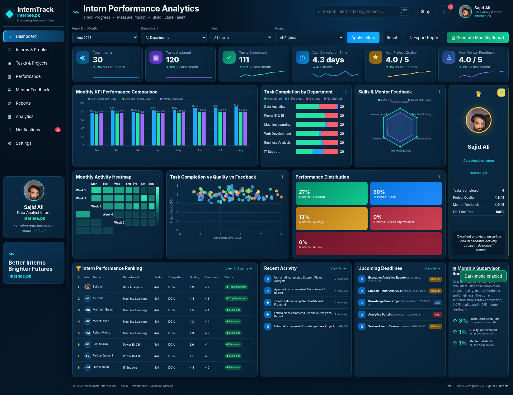

# 📊 Intern Performance Analytics
## Task 6 – Performance Evaluation Metrics | Internee.pk Data Analyst Internship

**Author:** Sajid Ali  
**Role:** Data Analyst Intern  
**Internship:** Internee.pk  
**Education:** BS Information Technology, Shah Abdul Latif University, Khairpur  
**Location:** Sindh, Pakistan

---

## Project Objective

This project evaluates and tracks intern performance through a metrics-based system. It directly implements the Task 6 requirements by measuring **task completion time**, **project quality**, and **mentor feedback**, automating KPI extraction through **Python and SQL**, and generating **monthly supervisor reports**.

The project is designed as a realistic portfolio implementation of an internship performance monitoring workflow. The included dataset is synthetic and contains no confidential internship records.

## 🌐 Live Project

- **Live Dashboard:** [Open the interactive dashboard](https://sajidexpertise.github.io/Performance-Analytics-Evaluation-Dashboard-Task-6-InterneePk/)
- **Portfolio:** [sajidexpertise.vercel.app](https://sajidexpertise.vercel.app/)
- **LinkedIn:** [linkedin.com/in/sajidexpertise](https://www.linkedin.com/in/sajidexpertise)

## Task 6 Requirement Mapping

| Guideline requirement | Project implementation |
|---|---|
| Design KPIs: task completion time | `completion_days`, Average Completion Time KPI, completion-time analysis and task table |
| Design KPIs: project quality | `project_quality` score (1–5), KPI card, monthly KPI comparison, bubble analysis and rankings |
| Design KPIs: mentor feedback | `mentor_feedback` score (1–5), KPI card, skills radar, feedback view, rankings and comments |
| Automate data extraction | SQLite database + `sql/monthly_metrics.sql` + `scripts/extract_monthly_metrics.py` |
| Create monthly reports | Eight supervisor HTML reports + interactive Generate Monthly Report button |

## 📊 Dashboard Preview 



> **Intern Performance Analytics & Evaluation Dashboard** — Task 6 of the Internee.pk Data Analyst Internship.

## Dashboard Design

The dashboard follows a modern dark analytics interface with blue/cyan accents and uses the selected reference layout as the visual direction. Dark mode is the default, and a working light/dark toggle is included.

The main dashboard contains:

- Reporting Month, Department, Intern and Project filters
- Apply Filters and Reset controls
- Global search (`Ctrl + K`)
- Export / print report control
- Generate Monthly Report control
- Six dynamic KPI cards with mini trends
- Monthly KPI grouped comparison chart
- Department task-completion stacked chart
- Skills & mentor feedback radar comparison
- Top-performing intern card using Sajid Ali's supplied profile photo when he is ranked first
- Monthly activity heatmap
- Completion Time vs Project Quality vs Mentor Feedback bubble chart
- Performance distribution cards
- Intern performance ranking table
- Recent activity feed
- Upcoming deadline panel
- Monthly supervisor summary
- Dedicated Interns, Tasks, Performance, Mentor Feedback, Reports, Analytics, Notifications and Settings pages

All visible controls are functional. Charts and KPI values recalculate when filters are applied.

## Dataset

The portfolio dataset contains:

- **30 intern profiles**
- **960 task-level performance records**
- **8 reporting months:** January–August 2026
- **6 internship departments**
- Multiple projects and task types per department
- Completion-time, quality, feedback and competency fields
- Upcoming deadlines and recent activity data

The default August 2026 view contains **120 assigned tasks** and **111 completed task records**, with KPI values calculated directly from the underlying task data.

### Main data files

- `data/performance_tasks.csv` – task-level fact table
- `data/interns.csv` – intern profile table
- `data/monthly_metrics.csv` – monthly KPI summary
- `data/intern_monthly_metrics.csv` – intern-by-month KPI table
- `data/upcoming_deadlines.csv` – deadline feed
- `data/recent_activity.csv` – activity feed
- `data/data_dictionary.csv` – field definitions
- `data/intern_performance.db` – SQLite database
- `data/task6_performance_evaluation.xlsx` – formatted Excel workbook

## KPI Definitions

### 1. Task Completion Rate

`Completed tasks / Assigned tasks × 100`

A task is counted as completed when it has an actual `completed_date`.

### 2. Average Completion Time

`Average(completion_days) for completed tasks`

This is reported in days. Lower time can be positive, but it should always be interpreted together with quality and mentor feedback.

### 3. Project Quality

`Average(project_quality) for completed tasks`

Scale: **1.0–5.0**.

### 4. Mentor Feedback

`Average(mentor_feedback) for completed tasks`

Scale: **1.0–5.0**.

### 5. On-Time Rate

`Completed on or before planned due date / completed tasks × 100`

### 6. Composite Performance Score

The ranking score is:

- **35%** task completion rate
- **30%** normalized project quality
- **25%** normalized mentor feedback
- **10%** on-time rate

Quality and feedback are normalized from a 1–5 scale to a 0–100 scale before weighting.

## Technology Stack

- HTML5
- CSS3
- Vanilla JavaScript
- SVG-based interactive charts
- Python 3
- SQLite
- SQL
- Excel workbook for audit/review

The web dashboard has **no CDN dependency** and can run directly from local files.

## Folder Structure

```text
Task_6_Intern_Performance_Analytics_InterneePk/
├── index.html
├── README.md
├── SUBMISSION_GUIDE.md
├── PROJECT_CHECKLIST.md
├── linkedin_post.txt
├── video_demo_script.md
├── requirements.txt
├── OPEN_DASHBOARD.bat
├── START_DASHBOARD.bat
├── assets/
│   ├── sajid-ali-professional.jpg
│   ├── selected-dashboard-reference.png
│   └── dashboard-preview.png
├── data/
│   ├── interns.csv
│   ├── performance_tasks.csv
│   ├── monthly_metrics.csv
│   ├── intern_monthly_metrics.csv
│   ├── upcoming_deadlines.csv
│   ├── recent_activity.csv
│   ├── data_dictionary.csv
│   ├── intern_performance.db
│   └── task6_performance_evaluation.xlsx
├── src/
│   ├── styles.css
│   ├── data.js
│   └── app.js
├── scripts/
│   ├── generate_dataset.py
│   ├── extract_monthly_metrics.py
│   └── validate_project.py
├── sql/
│   ├── monthly_metrics.sql
│   └── intern_performance_ranking.sql
└── outputs/
    ├── dashboard-screenshot.png
    ├── monthly_reports/
    │   ├── 2026-01_supervisor_report.html
    │   └── ... through 2026-08
    └── exports/
```

## How to Run on Windows

### Fastest method

1. Extract the ZIP file.
2. Open the project folder.
3. Double-click `index.html`.
4. The dashboard opens directly in your default browser.

You can also double-click `START_DASHBOARD.bat` or `OPEN_DASHBOARD.bat`.

### Optional local server mode

Run:

```bat
OPEN_DASHBOARD.bat server
```

The launcher checks Python in this order:

1. `C:\Python314\python.exe`
2. `python`
3. `py -3`

It starts a server at:

```text
http://localhost:8765/
```

Python is **not required** for normal dashboard viewing.

## Re-run the Automated KPI Extraction

From the project root:

```bash
python scripts/extract_monthly_metrics.py
```

For one month:

```bash
python scripts/extract_monthly_metrics.py 2026-08
```

The script reads `data/intern_performance.db` and writes fresh CSV/HTML output to `outputs/exports/`.

## Rebuild the Portfolio Dataset

```bash
python scripts/generate_dataset.py
```

This regenerates the CSV files, SQLite database, browser data payload and the eight monthly supervisor HTML reports.

## Validate the Project

```bash
python scripts/validate_project.py
```

The validator checks dataset sizes, KPI fields, database reconciliation, required automation files and monthly report coverage.

## Dashboard Usage

1. Select a reporting month.
2. Optionally select a department, intern or project.
3. Click **Apply Filters**.
4. Review the six KPI cards and all analytical visuals.
5. Use the dashboard navigation for task records, feedback and reports.
6. Use **Export Report** to print or save the visible report as PDF.
7. Use **Generate Monthly Report** to create a downloadable supervisor HTML report for the current filter.
8. Use **Tasks & Projects → Download Filtered CSV** to export filtered task data.

## Mobile Usage

The interface is responsive. On a phone:

1. Open `index.html` in Chrome or another modern browser.
2. Tap the menu button to open the sidebar.
3. Dashboard cards and charts stack vertically for readability.
4. Wide data tables can be swiped horizontally.

For a public mobile link, deploy the repository through GitHub Pages.

## GitHub Upload Instructions

Recommended repository name:

`Performance-Evaluation-Metrics-Task-6-InterneePk`

1. Create a new public GitHub repository.
2. Upload the **contents of this project folder** so `index.html` is at repository root.
3. Commit the files.
4. Keep the complete `data`, `src`, `assets`, `scripts`, `sql`, and `outputs` folders.

## GitHub Pages Deployment

1. Open the GitHub repository.
2. Go to **Settings → Pages**.
3. Under **Build and deployment**, choose **Deploy from a branch**.
4. Branch: `main`.
5. Folder: `/(root)`.
6. Save and wait for deployment.

Expected URL pattern after GitHub actually publishes it:

`https://sajidexpertise.github.io/Performance-Evaluation-Metrics-Task-6-InterneePk/`

Use the live URL only after confirming it opens successfully.

## Monthly Supervisor Reporting

The project includes static monthly report files for January–August 2026. The dashboard can also build a filtered report in the browser. Supervisors can use the reports to compare completion rate, average completion time, project quality, mentor feedback, on-time rate and top intern ranking.

## Data & Ethics Note

The data in this repository is a **realistic synthetic portfolio dataset** prepared to demonstrate internship performance analytics. It does not contain confidential records of real interns. The Sajid Ali profile is included at the author's request; other intern records are synthetic portfolio entries.

Performance metrics should support mentor decisions, not replace human review. Qualitative context, task difficulty and reasonable accommodations should be considered when interpreting scores.

## Known Limitations

- The dataset is portfolio data, not a production HR system.
- The dashboard runs entirely in the browser and does not write changes back to SQLite.
- Browser-generated reports represent the active dashboard filter; pre-generated reports represent the full month.
- The composite score is a transparent project scoring framework, not an official Internee.pk rating policy.

## Author

**Sajid Ali**  
Data Analyst Intern – Internee.pk  
BS Information Technology – Shah Abdul Latif University, Khairpur  
Sindh, Pakistan

---

**Task 6: Performance Evaluation Metrics**  
Track progress. Measure impact. Build better internship outcomes.


## Profile image
The dashboard uses `assets/sajid-ali-professional.jpg`, the user-provided professional office portrait, across the author/profile areas. The previous image is retained only as a reference asset.
